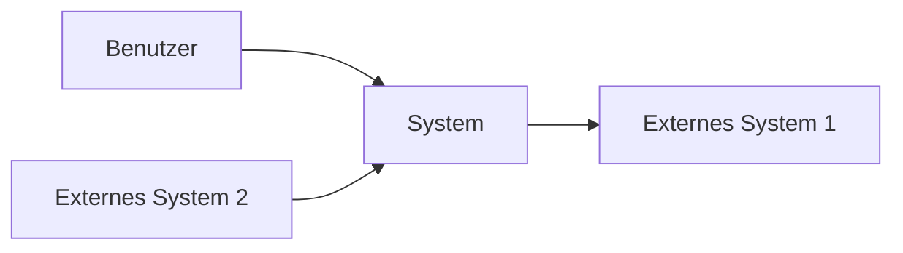
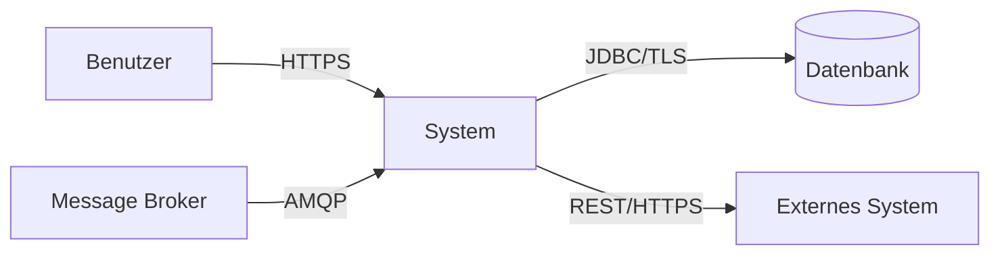

# arc42 Sektion 3: Kontextabgrenzung schreiben

## Zweck

Die Kontextabgrenzung grenzt das System von allen Kommunikationspartnern (Nachbarsystemen und Benutzern) ab. Sie spezifiziert die externen Schnittstellen aus fachlicher Sicht (immer) und aus technischer Sicht (optional).

**Dies ist eine der Kernsektionen der arc42-Dokumentation.**

## Dateistruktur

```
03-Kontextabgrenzung/
├── 03-01-Fachlicher-Kontext.md
└── 03-02-Technischer-Kontext.md
```

## Interaktive Fragen an den User

### Für 3.1 Fachlicher Kontext

1. **Wer benutzt das System?** Welche Benutzerrollen/Akteure gibt es?
2. **Mit welchen externen Systemen kommuniziert das System?** (Datenbanken, APIs, Services, Message-Broker)
3. **Welche Daten fließen rein und raus?** Pro Kommunikationspartner: Was wird gesendet/empfangen?
4. **Gibt es Batch-Prozesse oder zeitgesteuerte Interaktionen?**
5. **Welche fachlichen Domänen sind beteiligt?**

### Für 3.2 Technischer Kontext

1. **Über welche Protokolle kommuniziert das System?** (HTTP/REST, gRPC, AMQP, MQTT, JDBC etc.)
2. **Welche Netzwerk-Topologie liegt vor?** (LAN, WAN, VPN, Cloud)
3. **Gibt es spezielle Kommunikationskanäle?** (Message-Queues, Event-Streams, File-Transfer)
4. **Welche Authentifizierung/Autorisierung wird an den Schnittstellen verwendet?**
5. **Gibt es Quality-of-Service-Anforderungen an Schnittstellen?** (Latenz, Durchsatz, Verfügbarkeit)

## Codebase-Analyse-Hinweise

- **Externe Systeme**: Aus Connection-Strings, API-Clients, Feign/Retrofit-Interfaces, Database-Konfigurationen
- **Protokolle**: Aus Dependencies (spring-web → REST, spring-kafka → Kafka, grpc-stub → gRPC)
- **Schnittstellen**: Aus REST-Controllern, OpenAPI-Specs, Proto-Files, Message-Listener
- **Authentifizierung**: Aus Security-Konfigurationen (OAuth2, JWT, API-Keys)
- **Benutzerrollen**: Aus Security-Rollen, RBAC-Konfigurationen

## Templates

### 03-01-Fachlicher-Kontext.md

```markdown
# Fachlicher Kontext

## Kontextdiagramm

<!-- Beschreibe das System als Blackbox mit allen externen Kommunikationspartnern -->
<!-- Optional: Mermaid-Diagramm, PlantUML oder ASCII-Art -->



## Kommunikationspartner

| Partner | Eingabe (an System) | Ausgabe (vom System) | Beschreibung |
|---------|---------------------|---------------------|-------------|
| <Benutzer/Rolle> | <Was sendet der Partner?> | <Was erhält der Partner?> | <Kurzbeschreibung> |
| <Externes System 1> | <Eingabedaten> | <Ausgabedaten> | <Kurzbeschreibung> |
```

### 03-02-Technischer-Kontext.md

```markdown
# Technischer Kontext

## Technisches Kontextdiagramm

<!-- Zeigt die Kanäle und Protokolle zu den Kommunikationspartnern -->



## Kanal-Zuordnung

| Partner | Kanal/Protokoll | Datenformat | Authentifizierung | Bemerkung |
|---------|----------------|-------------|-------------------|-----------|
| <Partner 1> | <z.B. REST/HTTPS> | <z.B. JSON> | <z.B. OAuth2> | <optional> |
| <Partner 2> | <z.B. AMQP> | <z.B. Protobuf> | <z.B. mTLS> | <optional> |

## Mapping fachlich → technisch

| Fachliche Schnittstelle | Technische Realisierung |
|------------------------|------------------------|
| <z.B. Bestelleingang> | <z.B. POST /api/orders, JSON über HTTPS> |
```

## Best Practices (aus arc42-Tipps)

- **Kontextdiagramm ist Pflicht**: Zeige das System als Blackbox mit allen externen Partnern
- **Tabelle kombinieren**: Diagramm plus Tabelle ist die effektivste Darstellung
- **Alle Schnittstellen zeigen**: Keine externe Schnittstelle weglassen
- **Überblick statt Details**: Kontext soll Überblick geben, nicht zu viele Details
- **Datenflüsse zeigen**: Im fachlichen Kontext Datenflüsse statt nur Abhängigkeiten
- **Fachlich und technisch trennen**: Fachlicher Kontext zeigt WAS fließt, technischer Kontext zeigt WIE
- **Risiken an Schnittstellen markieren**: Besonders risikobehaftete externe Schnittstellen kennzeichnen
- **Kategorisieren bei vielen Partnern**: Bei >10 externen Systemen gruppieren/clustern

## Querverweise

- → **Sektion 5** (Bausteinsicht): Externe Schnittstellen aus dem Kontext müssen in der Bausteinsicht Level 1 wieder auftauchen
- → **Sektion 7** (Verteilungssicht): Technischer Kontext und Verteilungssicht haben Überschneidungen
- → **Sektion 10** (Qualitätsanforderungen): Quality-of-Service an externen Schnittstellen
