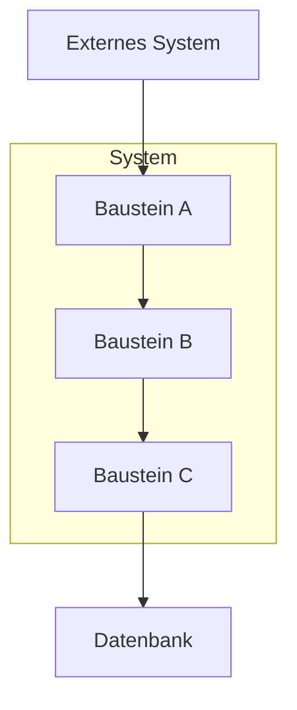
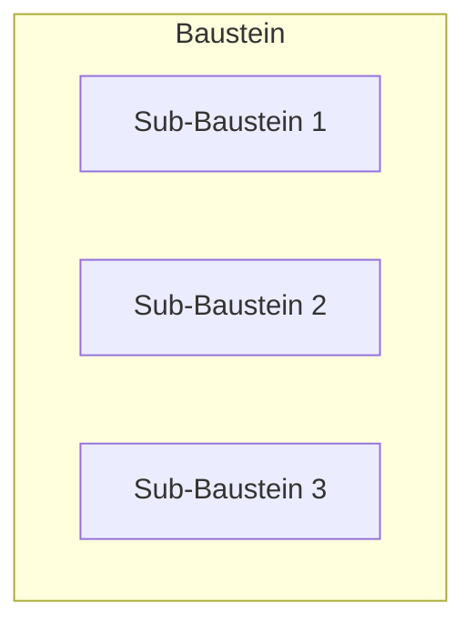

# arc42 Sektion 5: Bausteinsicht schreiben

## Zweck

Die Bausteinsicht zeigt die statische Zerlegung des Systems in Bausteine (Module, Komponenten, Subsysteme, Klassen, Packages, Libraries, Frameworks) sowie deren Abhängigkeiten.

**Dies ist eine Pflichtsektion und eine der Kernsektionen der arc42-Dokumentation.**

Die Bausteinsicht ist hierarchisch aufgebaut:
- **Ebene 1**: Whitebox des Gesamtsystems (Zerlegung in Blackboxes)
- **Ebene 2**: Whitebox einzelner Bausteine aus Ebene 1
- **Ebene 3+**: Weitere Verfeinerung bei Bedarf

## Dateistruktur

```
05-Bausteinsicht/
├── 05-01-Ebene-1.md
├── 05-02-Ebene-2-<Baustein-A>.md (optional)
├── 05-03-Ebene-2-<Baustein-B>.md (optional)
└── 05-0X-Ebene-3-<Detail>.md (selten nötig)
```

## Interaktive Fragen an den User

### Für Ebene 1 (Whitebox Gesamtsystem)

1. **Aus welchen Hauptbausteinen besteht das System?** (Top-Level-Module/Komponenten/Services)
2. **Was ist die Verantwortlichkeit jedes Bausteins?** (Ein Satz pro Baustein)
3. **Welche Abhängigkeiten bestehen zwischen den Bausteinen?**
4. **Gibt es eine Zerlegungsmotivation?** (Warum genau diese Aufteilung?)
5. **Welche wichtigen Schnittstellen gibt es zwischen Bausteinen?**

### Für Ebene 2 (bei Bedarf)

1. **Welche Bausteine aus Ebene 1 sind komplex genug für eine Verfeinerung?**
2. **Wie sind diese intern aufgebaut?** (Submodule, Klassen, Layer)
3. **Gibt es überraschende oder risikobehaftete innere Strukturen?**

## Codebase-Analyse-Hinweise

- **Ebene 1**: Aus Top-Level-Packages, Gradle/Maven-Module, Monorepo-Packages, Service-Verzeichnisse
- **Verantwortlichkeiten**: Aus Package-Namen, README-Dateien in Modulen, Hauptklassen
- **Abhängigkeiten**: Aus Import-Statements, Module-Dependencies, API-Aufrufe zwischen Services
- **Schnittstellen**: Aus öffentlichen Interfaces, API-Definitionen, Shared-DTOs
- **Ebene 2**: Aus Sub-Packages innerhalb der Top-Level-Module

## Templates

### 05-01-Ebene-1.md

```markdown
# Bausteinsicht — Ebene 1

## Whitebox Gesamtsystem

### Übersichtsdiagramm

<!-- Zeigt die Zerlegung des Gesamtsystems in seine Hauptbausteine -->



### Motivation

<Warum wurde das System genau so zerlegt? Welches Prinzip liegt zugrunde?>

### Enthaltene Bausteine

| Baustein | Verantwortlichkeit | Schnittstellen |
|----------|-------------------|----------------|
| <Baustein A> | <1-2 Sätze: Was macht dieser Baustein?> | <Wichtigste Interfaces> |
| <Baustein B> | <Verantwortlichkeit> | <Interfaces> |
| <Baustein C> | <Verantwortlichkeit> | <Interfaces> |

### Baustein A (Blackbox)

**Zweck/Verantwortlichkeit:** <Was macht dieser Baustein?>

**Schnittstellen:**
- <Interface 1>: <Beschreibung>
- <Interface 2>: <Beschreibung>

**Code-Location:** `<Pfad im Repository>`

<!-- Wiederhole Blackbox-Template für jeden wichtigen Baustein -->
```

### 05-02-Ebene-2.md (Template)

```markdown
# Bausteinsicht — Ebene 2: <Bausteinname>

## Whitebox <Bausteinname>

### Übersichtsdiagramm



### Motivation

<Warum wurde dieser Baustein so zerlegt?>

### Enthaltene Bausteine

| Sub-Baustein | Verantwortlichkeit |
|-------------|-------------------|
| <Sub 1> | <Verantwortlichkeit> |
| <Sub 2> | <Verantwortlichkeit> |
```

## Best Practices (aus arc42-Tipps)

- **Ebene 1 ist Pflicht**: Immer mindestens die Top-Level-Zerlegung dokumentieren
- **Hierarchisch aufbauen**: Blackboxes in Ebene N werden in Ebene N+1 als Whitebox verfeinert
- **Konsistenz mit Kontext**: Externe Schnittstellen aus Sektion 3 müssen in Ebene 1 auftauchen
- **Verantwortlichkeit pro Blackbox**: Jeder Baustein braucht eine klare Verantwortlichkeitsbeschreibung
- **Inneres verbergen**: Blackboxes zeigen nur die Außensicht, keine internen Details
- **Tabellen für Effizienz**: Bustistein-Tabellen sind kompakter als Fließtext
- **Motivation bei Whitebox**: Jede Whitebox-Zerlegung braucht eine Begründung
- **Nur wenige Bausteine verfeinern**: Nicht alles auf Ebene 2+ verfeinern, nur das Wichtige/Risikobehaftete
- **Quellcode-Mapping**: Erklären, wo im Repository die Bausteine zu finden sind
- **Kohäsion als Treiber**: Bausteine sollten nach Kohäsion geschnitten sein

## Querverweise

- ← **Sektion 3** (Kontextabgrenzung): Externe Schnittstellen müssen konsistent sein
- → **Sektion 6** (Laufzeitsicht): Szenarien verwenden die Bausteine aus dieser Sicht
- → **Sektion 7** (Verteilungssicht): Mapping der Bausteine auf Infrastruktur
- → **Sektion 8** (Konzepte): Querschnittliche Konzepte erklären gemeinsame Muster der Bausteine
