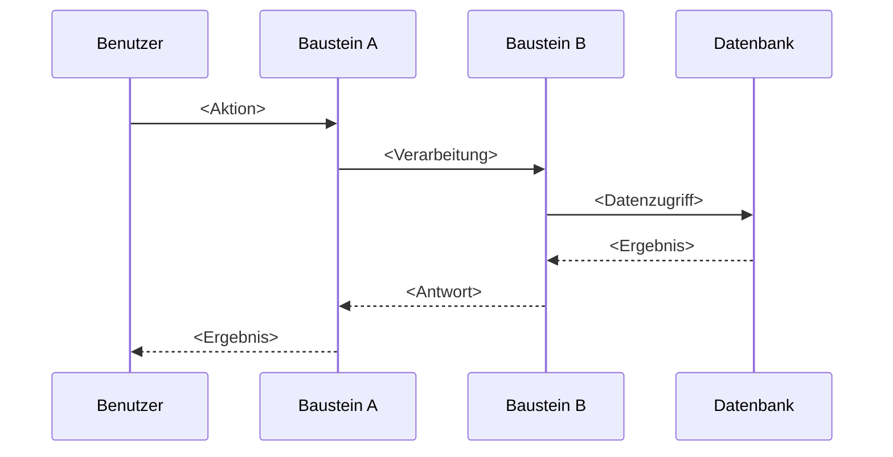

# arc42 Sektion 6: Laufzeitsicht schreiben

## Zweck

Die Laufzeitsicht beschreibt konkretes Verhalten und Interaktionen der Bausteine des Systems in Form von Szenarien:
- Wichtige Use-Cases oder Features: Wie führen die Bausteine sie aus?
- Interaktionen an kritischen externen Schnittstellen
- Betrieb und Administration: Start, Stopp, Konfiguration
- Fehler- und Ausnahmeszenarien

**Dies ist eine der Kernsektionen der arc42-Dokumentation.**

## Dateistruktur

```
06-Laufzeitsicht/
├── 06-01-<Szenario-1>.md
├── 06-02-<Szenario-2>.md
└── 06-0X-<Szenario-X>.md
```

Oder consolidated:

```
06-Laufzeitsicht/
└── 06-01-Szenarien.md
```

## Interaktive Fragen an den User

1. **Was sind die wichtigsten Use-Cases/Features des Systems?** (Top 3-5)
2. **Wie interagieren die Bausteine bei einem typischen Request?** (Happy Path)
3. **Gibt es kritische Fehlerszenarien?** Wie verhält sich das System bei Fehlern?
4. **Wie startet/stoppt das System?** Gibt es eine besondere Initialisierungsreihenfolge?
5. **Gibt es asynchrone Prozesse?** (Event-Verarbeitung, Batch-Jobs, Scheduled-Tasks)
6. **Was passiert an den kritischen externen Schnittstellen?** (Timeout, Retry, Fallback)

## Codebase-Analyse-Hinweise

- **Use-Cases**: Aus Controller-Methoden, Use-Case-Klassen, Command-Handler
- **Interaktionen**: Aus Service-Aufrufen, Event-Handler-Chains, Middleware-Pipelines
- **Fehlerbehandlung**: Aus Exception-Handler, Circuit-Breaker-Konfigurationen, Retry-Policies
- **Start/Stopp**: Aus Application-Bootstrap, Init-Scripte, Lifecycle-Hooks
- **Asynchrone Prozesse**: Aus Scheduler-Konfigurationen, Queue-Listener, Cron-Jobs

## Templates

### 06-01-Szenarien.md

```markdown
# Laufzeitsicht

## Szenario 1: <Name des Szenarios>

### Beschreibung

<Kurze textuelle Beschreibung: Was passiert, wer ist beteiligt, was ist das Ergebnis?>

### Ablauf



### Besonderheiten

- <Besondere Aspekte dieses Szenarios>
- <Fehlerbehandlung>
- <Performance-Aspekte>

---

## Szenario 2: <Fehlerszenario>

### Beschreibung

<Was passiert bei einem Fehler?>

### Ablauf

<!-- Sequenzdiagramm oder nummerierte Schrittliste -->

1. <Schritt 1>
2. <Schritt 2 — Fehler tritt auf>
3. <Fehlerbehandlung>
4. <Ergebnis>
```

## Best Practices (aus arc42-Tipps)

- **Existierende Bausteine verwenden**: Szenarien müssen Bausteine aus Sektion 5 referenzieren
- **Wenige, aber wichtige Szenarien**: 3-8 repräsentative Szenarien, nicht alle Use-Cases
- **Architektonische Relevanz**: Szenarien auswählen, die architektonisch bedeutsam sind
- **Schematisch statt detailliert**: Überblick zeigen, nicht jedes Detail
- **Verschiedene Arten**: Mix aus Happy-Path, Fehlerfall und Betriebsszenario
- **Sequenzdiagramme nutzen**: Besonders effektiv für die Darstellung von Interaktionen
- **Nummerierte Schrittlisten**: Einfache Alternative zu Diagrammen
- **Kleine und große Bausteine mischen**: Nicht nur Top-Level-Bausteine in Szenarien

## Querverweise

- ← **Sektion 5** (Bausteinsicht): Szenarien verwenden die hier definierten Bausteine
- ← **Sektion 3** (Kontext): Interaktionen an externen Schnittstellen
- → **Sektion 8** (Konzepte): Querschnittliches Verhalten (z.B. Fehlerbehandlung, Logging) als Konzept
