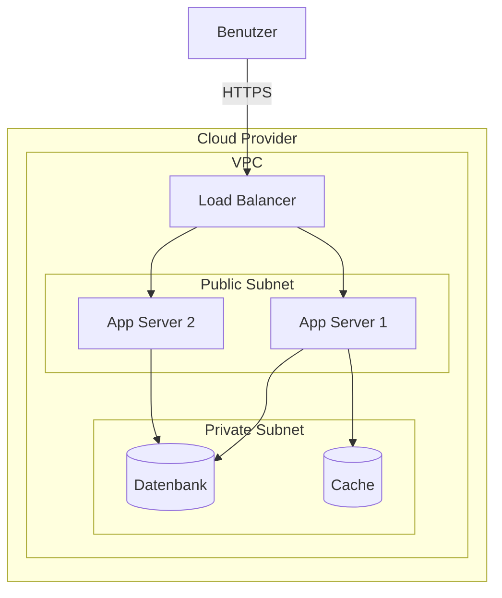

# arc42 Sektion 7: Verteilungssicht schreiben

## Zweck

Die Verteilungssicht beschreibt:
1. Die technische Infrastruktur zur Ausführung des Systems (Knoten, Netzwerke, Kanäle)
2. Das Mapping der Software-Bausteine auf diese Infrastrukturelemente

**Dies ist eine der Kernsektionen der arc42-Dokumentation.**

## Dateistruktur

```
07-Verteilungssicht/
├── 07-01-Infrastruktur.md
└── 07-02-<Umgebung>.md (optional, bei mehreren Umgebungen)
```

## Interaktive Fragen an den User

1. **Wo läuft das System?** (On-Premise, Cloud, Hybrid? Welcher Cloud-Provider?)
2. **Welche Server/Knoten gibt es?** (Application-Server, Datenbank-Server, Load-Balancer, CDN)
3. **Welche Umgebungen existieren?** (Development, Staging, Production)
4. **Wie werden die Software-Bausteine deployed?** (Container, VMs, Serverless, PaaS)
5. **Welche Netzwerk-Topologie liegt vor?** (VPC, Subnetze, DMZ, Firewalls)
6. **Wie wird skaliert?** (Horizontal, Vertikal, Auto-Scaling)
7. **Welcher Baustein läuft auf welchem Knoten?** (Mapping Software → Hardware)
8. **Gibt es besondere Qualitätsanforderungen an die Infrastruktur?** (Verfügbarkeit, Redundanz)

## Codebase-Analyse-Hinweise

- **Deployment**: Aus `Dockerfile`, `docker-compose.yml`, Kubernetes-Manifeste (`k8s/`, `helm/`)
- **Cloud-Infrastruktur**: Aus Terraform-Files (`.tf`), CloudFormation, Pulumi
- **CI/CD**: Aus `.github/workflows/`, `Jenkinsfile`, `.gitlab-ci.yml` → Deploy-Targets
- **Environments**: Aus Environment-spezifischen Configs (`application-prod.yml`, `.env.production`)
- **Scaling**: Aus HPA-Configs (Kubernetes), Auto-Scaling-Groups (AWS)

## Templates

### 07-01-Infrastruktur.md

```markdown
# Verteilungssicht

## Infrastruktur Ebene 1

### Übersichtsdiagramm



### Motivation

<Warum diese Infrastrukturstruktur? Welche Qualitätsanforderungen werden adressiert?>

### Qualitäts- und Performance-Merkmale

- **Verfügbarkeit:** <z.B. 99.9%, Multi-AZ Deployment>
- **Skalierung:** <z.B. Auto-Scaling 2-10 Instanzen>
- **Redundanz:** <z.B. Datenbank mit Read-Replicas>

### Mapping Software → Infrastruktur

| Software-Baustein | Infrastruktur-Knoten | Bemerkung |
|------------------|---------------------|-----------|
| <Baustein A> | <App Server (Container)> | <z.B. 2 Instanzen, 2 CPU, 4GB RAM> |
| <Baustein B> | <App Server (Container)> | <Co-located mit Baustein A> |
| <Datenbank-Schema> | <RDS PostgreSQL> | <db.r5.large, Multi-AZ> |

### Knoten-Beschreibungen

#### <Knoten 1: Application Server>

- **Typ:** <z.B. Container auf Kubernetes, EC2 t3.large>
- **OS:** <z.B. Alpine Linux 3.18>
- **Ressourcen:** <CPU, RAM, Storage>
- **Software:** <Installierte Software/Runtime>
```

## Best Practices (aus arc42-Tipps)

- **Infrastruktur dokumentieren**: Auch bei Cloud-Systemen die wesentliche Topologie beschreiben
- **Hardware-Entscheidungen begründen**: Warum diese Infrastruktur? Welche Alternativen gab es?
- **Alle Umgebungen dokumentieren**: Insbesondere wenn sich Prod von Dev signifikant unterscheidet
- **Hierarchisch aufbauen**: Ebene 1 zeigt den Überblick, Ebene 2 Details bei Bedarf
- **Mapping explizit machen**: Welcher Baustein läuft wo? Tabelle ist dafür ideal
- **Knoten erklären**: Jeden wichtigen Knoten kurz beschreiben (Typ, OS, Ressourcen)
- **UML-Deployment-Diagramme oder Mermaid**: Diagramme sind effektiver als nur Text

## Querverweise

- ← **Sektion 3.2** (Technischer Kontext): Technischer Kontext ist oft der Ausgangspunkt
- ← **Sektion 5** (Bausteinsicht): Bausteine werden auf Infrastruktur gemappt
- → **Sektion 8** (Konzepte): Deployment-Konzepte, CI/CD als querschnittliches Konzept
