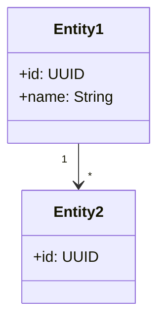

# arc42 Sektion 8: Querschnittliche Konzepte schreiben

## Zweck

Übergreifende, generelle Prinzipien und Lösungsansätze, die in vielen Teilen der Architektur einheitlich benutzt werden (→ cross-cutting). Konzepte bilden die Basis für konzeptionelle Integrität (Konsistenz, Homogenität) der Architektur.

**Dies ist eine der Kernsektionen der arc42-Dokumentation.**

Typische Themengebiete:
- Domänenmodell
- Persistenz/Datenzugriff
- Benutzeroberfläche/UX
- Geschäftsregeln/Validierung
- Fehlerbehandlung
- Logging/Monitoring
- Sicherheit/Autorisierung
- Kommunikation/Integration
- Testbarkeit
- Build/Deployment
- Konfigurationsmanagement

## Dateistruktur

```
08-Konzepte/
├── 08-01-Domaenenmodell.md
├── 08-02-Persistenz.md
├── 08-03-Fehlerbehandlung.md
├── 08-04-Logging.md
├── 08-05-Sicherheit.md
├── 08-06-Testbarkeit.md
└── 08-XX-<Weiteres-Konzept>.md
```

Ein File pro Konzept. Nur die relevanten Konzepte erstellen — nicht alle möglichen Themen abdecken!

## Interaktive Fragen an den User

1. **Gibt es ein Domänenmodell?** Welche Kernentitäten und deren Beziehungen gibt es?
2. **Wie wird Persistenz gehandhabt?** (ORM, Repository-Pattern, Event-Sourcing etc.)
3. **Wie werden Fehler behandelt?** (Globaler Error-Handler, Error-Codes, Retry-Strategien)
4. **Wie wird geloggt/gemonitort?** (Log-Framework, Log-Level-Strategie, Monitoring-Stack)
5. **Wie ist die Sicherheit umgesetzt?** (Authentifizierung, Autorisierung, Verschlüsselung)
6. **Wie wird getestet?** (Test-Pyramide, Test-Strategien, Mocking-Ansatz)
7. **Gibt es ein einheitliches UI/UX-Konzept?**
8. **Welche übergreifenden Architekturmuster werden verwendet?** (z.B. CQRS, Event-Sourcing, Saga-Pattern)

## Codebase-Analyse-Hinweise

- **Domänenmodell**: Aus Entity-Klassen, Domain-Packages, @Entity/@Document-Annotationen
- **Persistenz**: Aus Repository-Interfaces, ORM-Konfigurationen, Migration-Scripts
- **Fehlerbehandlung**: Aus GlobalExceptionHandler, ErrorController, error-handling-Middleware
- **Logging**: Aus logback.xml, log4j2.xml, Winston/Pino-Konfiguration, Logging-Interceptors
- **Sicherheit**: Aus SecurityConfig, JWT-Filter, RBAC-Policies, CORS-Konfiguration
- **Testbarkeit**: Aus Test-Verzeichnisstruktur, Testcontainers, Mock-Konfigurationen
- **Patterns**: Aus Code-Strukturen (Strategy-Pattern, Factory, Observer etc.)

## Templates

### 08-XX-Konzept.md (Generisches Template)

```markdown
# <Konzeptname>

## Problemstellung

<Welches übergreifende Problem löst dieses Konzept?>

## Lösung

<Wie wird das Problem gelöst? Welcher Ansatz/welches Pattern wird verwendet?>

## Umsetzung

<Konkrete Umsetzungsdetails, ggf. mit Code-Beispielen>

```<sprache>
// Beispielcode (optional)
```

## Geltungsbereich

<Für welche Bausteine/Teile des Systems gilt dieses Konzept?>

## Alternativen

<Welche Alternativen wurden betrachtet? Warum wurde dieser Ansatz gewählt?>
```

### 08-01-Domaenenmodell.md (Spezifisches Template)

```markdown
# Domänenmodell

## Übersicht



## Kernentitäten

| Entität | Beschreibung | Wichtige Attribute |
|---------|-------------|-------------------|
| <Entity 1> | <Beschreibung> | <Attribute> |
| <Entity 2> | <Beschreibung> | <Attribute> |

## Beziehungen

- <Entity 1> hat viele <Entity 2>
- <Entity 3> gehört zu <Entity 1>

## Invarianten/Geschäftsregeln

- <Regel 1: z.B. "Eine Bestellung muss mindestens eine Position enthalten">
- <Regel 2>
```

## Best Practices (aus arc42-Tipps)

- **Nur relevante Konzepte**: Nicht alle möglichen Themen abdecken, nur die systemrelevanten
- **HOW erklären**: Konzepte erklären WIE etwas funktioniert, nicht nur WAS
- **Code-Beispiele**: Technische Konzepte mit konkretem Code illustrieren
- **Domänenmodell ist oft das wichtigste Konzept**: Mindestens das Datenmodell dokumentieren
- **Abgrenzung zu Entscheidungen (S9)**: Konzepte beschreiben HOW (Umsetzung), Entscheidungen beschreiben WHAT/WHY (Entscheidungsgrund)
- **Querverlinkung zu Bausteinen**: Welche Bausteine verwenden welches Konzept?
- **Checkliste nutzen**: arc42 bietet eine Themen-Checkliste als Inspiration

## Querverweise

- ← **Sektion 5** (Bausteinsicht): Konzepte erklären gemeinsame Muster der Bausteine
- ← **Sektion 4** (Lösungsstrategie): Konzepte detaillieren die Strategieansätze
- ↔ **Sektion 9** (Entscheidungen): Klare Abgrenzung: Konzept = HOW, Entscheidung = WHAT+WHY
- → **Sektion 12** (Glossar): Domänenbegriffe aus dem Domänenmodell ins Glossar aufnehmen
